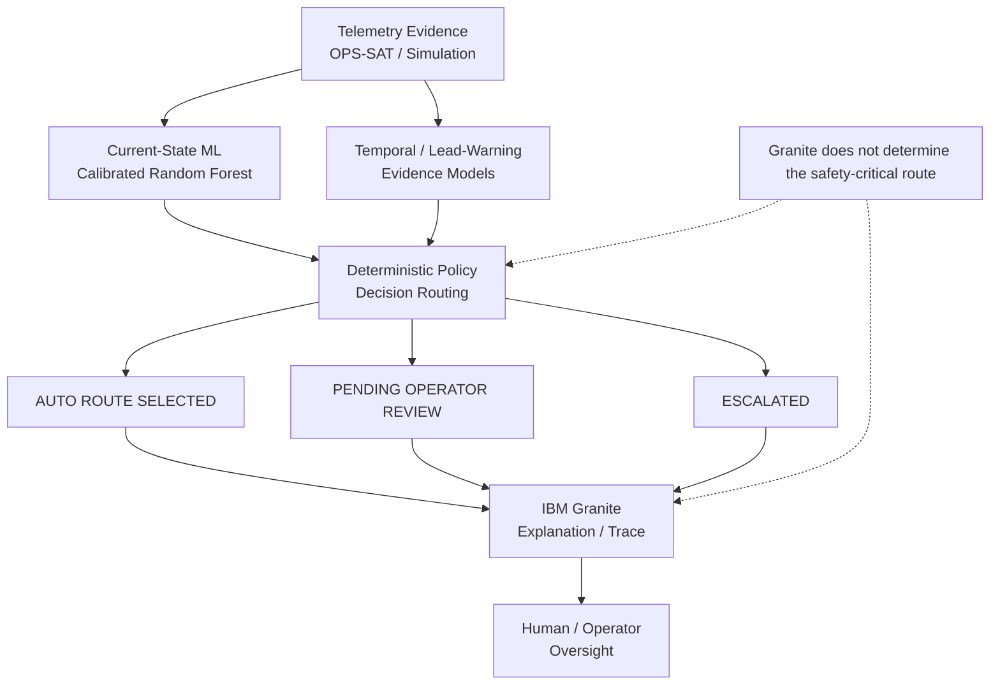

# 🛰️ HelioMesh

AI-Assisted Satellite Mission Control System

Author: Imene Rouis

Live Demo: https://heliomesh-woad.vercel.app/

Backend API: https://heliomesh-api.onrender.com

## AI-Powered Decision Intelligence for Spacecraft Operations

**IBM AI Builders Challenge — August 2026 · Advance Space Exploration with AI**

HelioMesh is a spacecraft decision-intelligence prototype that combines real OPS-SAT telemetry evidence, calibrated machine learning, temporal evidence, deterministic safety routing, and IBM Granite explanations.

Its central question is not only:

> "Is this telemetry anomalous?"

but:

> "Given the available evidence, what should the system route for review, escalation, or automatic clearance?"

HelioMesh deliberately separates evidence generation, deterministic decision policy, explanation, and human oversight.

**Important:** HelioMesh is a prototype decision-support system. It does not autonomously command a real spacecraft.
**IBM Granite Runtime is optional; when unavailable, HelioMesh preserves the deterministic decision route and continues safely.**

---

## Why HelioMesh

Many anomaly-detection systems stop at a prediction:

**Telemetry → Anomaly / Normal**

HelioMesh adds an auditable decision layer:

```text
Real telemetry
      ↓
Current-state ML evidence
      ↓
Temporal / lead-warning evidence
      ↓
Deterministic policy
      ↓
AUTO CLEAR / PENDING OPERATOR REVIEW / ESCALATED
      ↓
IBM Granite explanation
```

The route is computed by deterministic code before Granite is used for explanation.

This means the LLM does not determine the safety-critical route or invent the underlying metrics.

---

## What is actually validated

HelioMesh separates its evidence into two tracks.

### Real OPS-SAT-AD evidence

The real-spacecraft validation uses the official held-out OPS-SAT-AD test partition.

The Phase 3 experiments align results by actual segment ID rather than row position.

**Final aligned test set:**

529 segments

The benchmark provides real telemetry acquired on ESA's OPS-SAT mission and a predefined train/test structure. The dataset contains acquired telemetry in `segments.csv` and extracted features in `dataset.csv`. The upstream benchmark explicitly emphasizes reproducible and transparent evaluation.

### Controlled simulation

HelioMesh also contains a separate simulation benchmark for temporal and multi-state decision experiments.

Simulation results are not presented as real spacecraft validation.

In particular:

* the simulation benchmark does not prove a real 30-minute operational forecasting horizon;
* the real OPS-SAT benchmark does not validate the 30-minute simulation horizon;
* temporal simulation performance and real OPS-SAT anomaly-detection performance are reported separately.

---

## Architecture



Granite is an explanation layer, not the source of the underlying safety decision.

---

## Real OPS-SAT-AD validation

### Baseline anomaly detection

On the official held-out test partition:

| Metric              | Result |
| ------------------- | -----: |
| F1                  | 0.9209 |
| Event Recall        | 0.8761 |
| Event Precision     | 0.9706 |
| ROC-AUC             | 0.9874 |
| PR-AUC              | 0.9677 |
| MCC                 | 0.9027 |
| True anomaly events |    113 |
| Detected            |     99 |
| Missed              |     14 |
| False alerts        |      3 |

These results are for the real OPS-SAT benchmark and should not be interpreted as proof of real-time spacecraft failure prediction.

---

## Phase 3 — Decision Intelligence Ablation

The primary A→D ablation evaluates progressively richer decision architectures on the same held-out test partition.

### Architecture definitions

**A — Raw RF + simple routing**

**B — Calibrated RF + simple routing**

**C — Calibrated RF + deterministic routing**

**D — Full HelioMesh**

D includes:

* calibrated RF
* temporal evidence
* lead-warning evidence
* deterministic routing

No decision threshold was tuned on the held-out test partition.

### A→D results

| Architecture               | Recall | Precision |     F1 | Missed | False Alerts | Unsafe AUTO | Utility* |
| -------------------------- | -----: | --------: | -----: | -----: | -----------: | ----------: | -------: |
| A — Raw RF                 | 0.8761 |    0.9706 | 0.9209 |     14 |            3 |          14 |   0.7953 |
| B — Calibrated RF          | 0.8761 |    0.9802 | 0.9252 |     14 |            2 |          14 |   0.7981 |
| C — Calibrated RF + policy | 0.8761 |    0.9802 | 0.9252 |     14 |            2 |          14 |   0.7427 |
| D — Full HelioMesh         | 0.9204 |    0.9123 | 0.9163 |      9 |           10 |           9 |   0.8299 |

* Utility values are prototype analytical assumptions, not mission-validated operational costs.

### What D actually changes

Compared with C, D produces:

* 5 fewer missed anomalies
* 5 fewer unsafe automatic clearances
* +4.42 percentage points recall
* +0.0871 utility under the prototype baseline
* 8 additional false alerts
* −0.0089 F1

Therefore:

D is not a strict improvement across every metric. It is an explicit safety-oriented routing trade-off.

On the held-out benchmark, D reduces missed anomalies and unsafe automatic clearance while increasing false alerts.

---

## Decision Stress Test

The most important Phase 3 audit is a per-segment C→D routing analysis.

All 529 held-out test segments were traced.

### What changed?

113 segments changed route between C and D.

Of these:

**AUTO_CLEAR → PENDING_APPROVAL**

13 cases

**PENDING_APPROVAL → ESCALATED**

100 cases

There were no AUTO_CLEAR → ESCALATED transitions in this trace.

### The 13 AUTO_CLEAR cases

These are the cases that directly expose the safety/workload trade-off.

| Outcome                                  | Count |
| ---------------------------------------- | ----: |
| True anomalies protected from AUTO_CLEAR |     5 |
| Normal cases newly routed for review     |     8 |

The five protected anomalies were attributed by the decision trace to:

* 4 lead-warning-only branches
* 1 temporal-signal branch

The eight new false alerts were attributed to:

* 7 lead-warning-only branches
* 1 temporal-signal branch

Ground truth was used only after the routing decision to classify outcomes. It was not used to explain why the decision branch fired.

This gives HelioMesh a traceable benchmark-level statement:

The full decision layer selectively intercepts cases that the calibrated baseline would have auto-cleared: on this held-out benchmark, 5 were real anomalies and 8 were normal cases.

This is evidence of a measurable decision trade-off, not evidence of operator preference or mission-approved workload.

---

## Contribution Ablation

The next question is:

> What actually causes the improvement in D?

We therefore evaluated:

* C
* C + Temporal
* C + Lead Warning
* D = C + Temporal + Lead Warning

on the same aligned 529 test segments.

| Architecture       | Recall |     F1 | Missed | False Alerts |
| ------------------ | -----: | -----: | -----: | -----------: |
| C — Calibrated RF  | 0.8761 | 0.9252 |     14 |            2 |
| C + Temporal       | 0.8850 | 0.9259 |     13 |            3 |
| C + Lead Warning   | 0.9115 | 0.9156 |     10 |            9 |
| D — Full HelioMesh | 0.9204 | 0.9163 |      9 |           10 |

The component deltas show:

### C → C + Temporal

* Recall: +0.88 pp
* Missed: 14 → 13
* False alerts: +1
* F1: approximately unchanged

### C → C + Lead Warning

* Recall: +3.54 pp
* Missed: 14 → 10
* False alerts: +7
* F1: −0.0097

### C → D

* Recall: +4.42 pp
* Missed: 14 → 9
* False alerts: +8
* F1: −0.0089

The full D reproduction was independently checked against the official Phase 3 artifact and passed.

### Correct interpretation

On this benchmark, the lead-warning branch accounts for most of the incremental recall improvement over C, while temporal evidence provides a smaller additional gain.

This does not mean the lead-time model is a strong standalone predictor.

---

## Temporal / Lead-Time Result

The real lead-time classifier is intentionally reported as a limitation:

| Metric       | Result |
| ------------ | -----: |
| F1           | 0.3121 |
| Recall       | 0.2348 |
| Missed       |     88 |
| False alerts |     31 |

The model predicts whether the next same-channel segment is anomalous.

It is therefore not a validated 30-minute spacecraft forecasting model.

The real-data result should be understood as a supporting warning signal inside the decision policy, not as proof of reliable long-horizon spacecraft failure prediction.

---

## Utility Sensitivity

The prototype utility matrix is not mission-validated, so HelioMesh does not rely on one cost matrix alone.

C and D were evaluated under five explicitly declared analytical scenarios.

| Scenario              |      C |      D |   D − C | Winner |
| --------------------- | -----: | -----: | ------: | ------ |
| Prototype baseline    | 0.7427 | 0.8299 | +0.0871 | D      |
| Conservative safety   | 0.6096 | 0.7769 | +0.1673 | D      |
| Permissive            | 0.7590 | 0.8102 | +0.0512 | D      |
| Recall-focused        | 0.3664 | 0.5346 | +0.1682 | D      |
| False-alert-sensitive | 0.7401 | 0.8136 | +0.0735 | D      |

Result:

D outscored C in 5/5 declared analytical scenarios.

This is a sensitivity result, not a claim that the chosen costs represent a real mission.

The study explicitly records:

```text
mission_cost_validation = false
```

---

## Why the trade-off matters

A safety-oriented decision system should not be evaluated only by classification accuracy.

HelioMesh exposes the operational trade-off:

```text
More review
     ↓
More false alerts
     ↓
Fewer missed anomalies
     ↓
Fewer unsafe automatic clearances
```

On the held-out benchmark:

```text
Missed anomalies       14 → 9
Unsafe AUTO clearance  14 → 9
False alerts            2 → 10
```

The correct interpretation is therefore:

HelioMesh demonstrates measurable benchmark decision value under an explicit safety-oriented trade-off, rather than claiming universal superiority.

Whether that trade-off is desirable in a real mission requires mission-specific cost modelling and operator validation.

---

## IBM Granite

Granite is intentionally kept downstream of deterministic decision logic.

```text
ML evidence
    ↓
Deterministic policy
    ↓
Route
    ↓
Granite explanation
```

The system is designed so that Granite explains the evidence and decision trace rather than becoming the source of the safety-critical calculation.

A structural Granite grounding audit currently reports:

```text
Grounding score:      1.0000
Contradiction count:  0
Coverage A:           True
Coverage B:           True
```

This is a structural audit, not a live human-rated LLM reasoning evaluation.

---

## How IBM Bob Was Used

IBM Bob was the primary AI-assisted development tool used during the construction and validation of HelioMesh.

Rather than using Bob only for code generation, the project used it across concrete engineering workflows:

### Architecture

Bob was used during the design of the separation between:

```text
ML evidence
    ↓
Deterministic Decision Engine
    ↓
IBM Granite explanation
    ↓
Human oversight
```

This separation became a core architectural constraint: the deterministic policy computes the route, while Granite explains the resulting evidence and decision trace. The software design documents explicitly define the AI Agent as the Predict/Explain/Recommend/Report layer and the Decision Engine as the component responsible for confidence-based routing.

### Implementation

Bob was used iteratively while building the FastAPI backend, AI-agent integration, validation code, and Next.js dashboard.

The resulting architecture keeps model evidence and policy computation in Python services while exposing decision traces and routing states through the dashboard.

### Debugging and integration

Bob-assisted development was also used during integration work involving the IBM watsonx/Granite path and the local application stack.

A concrete example of the resulting engineering behavior is that HelioMesh was designed so that a Granite failure does not change the deterministic route. Runtime traces explicitly preserve the policy decision when Granite is unavailable, rather than allowing an LLM/API failure to alter the safety route.

This behavior is covered by the routing test:

```text
test_routing_unchanged_when_granite_unavailable
```

### Validation engineering

Bob was used throughout the development of the reproducibility and validation workflow, including the Phase 3 real OPS-SAT decision-intelligence ablation.

The final validation pipeline uses:

* actual segment-ID alignment rather than row-position comparison;
* an official held-out OPS-SAT-AD test partition;
* fixed random seeds for reproducibility;
* frozen-artifact integrity checks;
* deterministic policy evaluation;
* per-segment decision-stress analysis;
* component contribution ablation;
* utility sensitivity analysis.

These are not presented as "AI-generated evidence": each resulting metric was produced by executable validation code and independently checked against the saved artifacts.

### Scientific review

Bob was also used as an iterative review tool while tightening the project's claims.

This led to an explicit separation between:

```text
REAL OPS-SAT EVIDENCE
        ≠
CONTROLLED SIMULATION
```

and between:

```text
BENCHMARK DECISION VALUE
        ≠
MISSION-VALIDATED OPERATIONAL VALUE
```

The final README therefore reports the actual trade-off in the held-out benchmark — including the increase in false alerts — instead of describing the full HelioMesh architecture as an across-the-board performance improvement.

### Ownership and verification

IBM Bob assisted development; it did not replace project ownership or experimental verification.

Architecture decisions, validation methodology, model artifacts, safety constraints, result interpretation, and final submission claims were reviewed by the project author.

Numerical claims used in the final submission are derived from executable project artifacts rather than from Bob-generated prose.

---

## Testing

The Granite routing test suite currently reports:

**3 passed**
**1 warning**

Command:

```bash
python -m pytest -v --import-mode=importlib
```

Tests include:

```text
test_granite_available
test_granite_unavailable
test_routing_unchanged_when_granite_unavailable
```

The final test result is:

**3/3 passed.**

The warning is a dependency deprecation warning from the Starlette/httpx test stack and is not a failed test.

---

## Reproducibility

The real Phase 3 experiments use:

* official held-out OPS-SAT-AD test partition
* segment-ID alignment
* `random_state=42`
* no test-set threshold tuning

Frozen model artifacts are checked by SHA-256 prefix verification:

```text
ml/risk_model.pkl
ml/label_encoder.pkl
ml/forecaster_model.pkl
ml/forecaster_metrics.json
```

The Phase 3 validation also checks that train and test segments do not overlap.

---

## Repository Structure

```text
heliomesh/
├── agent/
│   ├── agent.py
│   └── test_connection.py
│
├── api/
│   ├── main.py
│   └── test_decision_granite.py
│
├── dashboard/
│   └── ...
│
├── engine/
│   └── ...
│
├── ml/
│   ├── risk_model.pkl
│   ├── label_encoder.pkl
│   ├── forecaster_model.pkl
│   └── forecaster_metrics.json
│
├── data/
│   └── real_spacecraft/
│       └── opssat_ad/
│
├── validation/
│   ├── real_spacecraft/
│   │   └── opssat_ad/
│   │       └── phase3_ablation.py
│   │
│   └── results/
│       ├── real_decision_ablation.json
│       ├── real_decision_stress_test_segments.csv
│       ├── real_decision_stress_test_summary.json
│       ├── real_contribution_ablation.json
│       ├── real_contribution_ablation.csv
│       ├── real_utility_sensitivity.json
│       └── real_utility_sensitivity.csv
│
├── requirements.txt
├── README.md
└── ...
```

---

## Running the Main Validation

### Phase 3 real decision-intelligence ablation

```bash
python validation/real_spacecraft/opssat_ad/phase3_ablation.py
```

### Utility sensitivity

```bash
python utility_sensitivity.py
```

### Contribution ablation

```bash
python contribution_ablation.py
```

### Tests

```bash
python -m pytest -v --import-mode=importlib
```

---

## Dashboard Safety Language

The dashboard deliberately avoids implying that this prototype executes spacecraft commands.

Route labels should use:

```text
AUTO ROUTE SELECTED
PENDING OPERATOR REVIEW
ESCALATED
```

Action-panel wording:

```text
PROTOTYPE ACTION RECOMMENDATION
```

Every decision should display:

> No spacecraft command is executed by this prototype.

The prototype may recommend an operational action in simulation or demonstration contexts, but it does not directly actuate a real spacecraft.

---

## Known Limitations

### 1. This is a prototype

HelioMesh has not been validated as flight software and does not directly control a spacecraft.

### 2. The D trade-off is real

D improves recall and reduces missed anomalies and unsafe AUTO clearance on the held-out benchmark, but increases false alerts.

Therefore D is not a strict improvement on every metric.

### 3. The temporal/lead-time model is weak standalone

The real lead-time predictor has:

```text
F1 = 0.3121
Recall = 0.2348
```

It should not be presented as a reliable standalone future-failure predictor.

### 4. No operator validation

No spacecraft-operator or human-factors study has been conducted.

Therefore HelioMesh does not claim validated operator workload reduction, usability, trust, or mission acceptance.

### 5. Utility assumptions are analytical

The utility matrices are prototype sensitivity assumptions.

They have not been validated against real mission costs or operator preferences.

### 6. No validated 30-minute real-data forecast

The real OPS-SAT benchmark does not establish a 30-minute operational forecasting horizon.

The controlled simulation benchmark and the real OPS-SAT validation therefore remain separate evidence tracks.

### 7. Contribution attribution is benchmark evidence, not causal proof

The contribution ablation shows how routing metrics change when temporal or lead-warning branches are enabled.

It does not prove causal real-world operational superiority.

---
## Path to Operational Use

HelioMesh is intentionally presented as a prototype rather than flight-ready software. A credible path toward operational use would require:

1. **Multi-mission validation** — evaluate the decision policy and anomaly models across additional spacecraft missions and telemetry regimes.
2. **Operator-in-the-loop evaluation** — conduct structured trials with spacecraft operations personnel to assess workload, review time, decision usefulness, and trust.
3. **Mission-specific calibration** — replace prototype risk weights and routing thresholds with requirements derived from a specific mission's safety and operational constraints.
4. **Long-duration temporal validation** — establish a genuinely supported forecasting horizon using telemetry with an appropriate temporal sampling structure.
5. **Operational assurance** — add the verification, monitoring, cybersecurity, fault containment, and software assurance processes required for a real mission environment.

The current system is therefore best understood as a validated decision-intelligence prototype with a defined path toward operational evaluation, not as flight software.

---
## Scientific Integrity

HelioMesh deliberately follows these rules:

* Do not call the OPS-SAT benchmark a NASA dataset.
* Do not claim real-time spacecraft command execution.
* Do not present synthetic simulation as real spacecraft validation.
* Do not claim a validated 30-minute real-data forecast.
* Do not describe the lead-time model as a strong standalone predictor.
* Do not describe prototype utility as mission-validated cost.
* Do not claim operator validation that was not performed.
* Do not hide the increase in false alerts.
* Do not tune decision thresholds on the official held-out test set.
* Do not use ground truth to explain why a decision was made.
* Do not let Granite replace deterministic policy computation.

---

## Dataset and References

### Primary real-data benchmark

**OPS-SAT-AD — anomaly detection dataset for satellite telemetry**

Zenodo DOI:

```text
10.5281/zenodo.12588359
```

The dataset record describes OPS-SAT telemetry acquired during the ESA OPS-SAT mission and provides the benchmark's train/test structure and associated files.

**Upstream repository:**

```text
kplabs-pl/OPS-SAT-AD
```

**Benchmark reference:**

Ruszczak, B., Kotowski, K., Evans, D., Nalepa, J.
*The OPS-SAT benchmark for detecting anomalies in satellite telemetry.*

The dataset and its upstream code should be treated as separate licensing objects; consult the current upstream records before redistributing either one.

---

## Final Position

HelioMesh does not claim to be a finished spacecraft operations system.

Its contribution is narrower and more testable:

Given anomaly evidence from real held-out spacecraft telemetry, HelioMesh adds a deterministic decision layer that changes routing in measurable and auditable ways.

On the official held-out benchmark:

```text
A → D

Missed anomalies:      14 → 9
Unsafe AUTO clearance: 14 → 9
Recall:                0.8761 → 0.9204
False alerts:           3 → 10
```

For the calibrated-policy comparison:

```text
C → D

Missed anomalies:      14 → 9
Unsafe AUTO clearance: 14 → 9
Recall:                +4.42 pp
False alerts:           2 → 10
Utility:               +0.0871
```

And the routing change is traceable:

```text
13 AUTO_CLEAR → PENDING_OPERATOR_REVIEW
    5 true anomalies
    8 normal cases

100 PENDING_OPERATOR_REVIEW → ESCALATED
```

The component ablation further shows that, on this benchmark, the lead-warning branch contributes most of the incremental recall improvement, while temporal evidence provides a smaller additional gain.

The result is not a claim of universal operational superiority.

It is a measurable, auditable decision-intelligence experiment on real spacecraft telemetry — with its trade-offs and limitations exposed rather than hidden.
